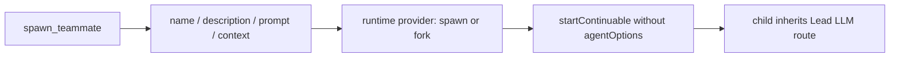
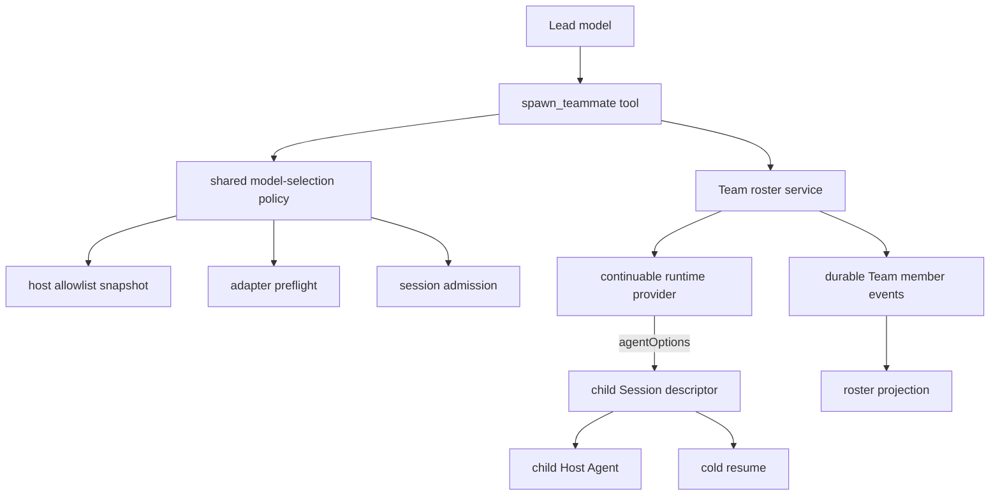
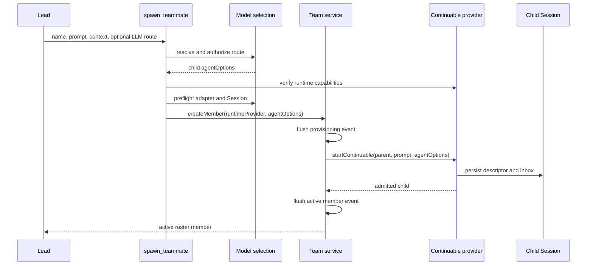
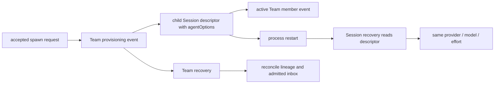

# Agent Note: Agent Team heterogeneous model routing

Status: implemented

English | [中文](2026-09-28-agent-team-heterogeneous-model-routing.zh.md)

## Problem

When we traced `spawn_teammate` end to end, we found that it accepted only a teammate name, description, prompt, and context mode. The context mode selected the continuable-subagent runtime provider (`spawn` or `fork`), but the call carried no child `AgentOptions`. In practice, this meant that `startContinuable` created every teammate with the Lead Agent's LLM provider, model, and compatible reasoning effort.

The awkward part was that two different decisions had been folded into one provider concept. A runtime provider decides how a child Session starts and which history it receives; an LLM provider decides which adapter and model execute that child. A Team could ask for fresh or forked context, but it could not assign a specialist model, validate that route before changing the durable roster, or recover the selected route after a process restart.

## Decision

We kept `context` as the runtime choice and added optional `provider`, `model`, and `reasoning_effort` fields for the child LLM route. `provider` and `model` are one pair: callers provide both or neither. Leaving them out keeps the familiar behavior of inheriting a compatible route from the Lead. When callers do choose a route, it must come from `list_subagent_models`; we do not ask a model or integrator to guess provider and model identifiers.

We deliberately reused the ordinary subagent model-selection authority through the public `@deepseek-ai/dsh-tool-subagent/model-selection` entry point. That module already owns allowlist snapshots, inheritance, reasoning-effort normalization, adapter preflight, and Session-level admission. Keeping that ownership in one place means the Team code does not grow a second model registry or reinterpret adapter capabilities in a slightly different way.

By the time the request reaches the Team service, the two choices are explicit. `provider` remains the continuable runtime provider name, while `agentOptions` carries the resolved LLM provider, model, and optional reasoning effort. The service records the runtime provider in the Team member snapshot and passes `agentOptions` to `startContinuable`; the child Session descriptor remains the durable owner of the effective LLM route.

## Architecture

We kept the split visible in the architecture because each layer answers a different question: what the model may request, what the deployment allows, how the child starts, and where its selected route survives.

| Layer | Responsibility | Input | Durable output |
|---|---|---|---|
| `spawn_teammate` tool | Exposes model-facing fields and resolves one authorized route before Team mutation | context, provider, model, reasoning effort | None |
| Shared model-selection policy | Applies allowlist, inheritance, normalization, and adapter/session preflight | Lead options and requested route | None |
| Team roster service | Reserves identity, records provisioning, and starts the continuable child | runtime provider and resolved `agentOptions` | Team member events |
| Continuable subagent runtime | Creates fresh or forked history and the child Session | prompt, parent, runtime provider, `agentOptions` | Child Session descriptor and inbox |
| Child Session descriptor | Owns the effective LLM route across unload and restart | admitted `AgentOptions` | provider, model, reasoning effort |

## Request flow

We placed the safety boundary before durable Team mutation. The tool completes every route check before `createMember` appends a provisioning event. Invalid pairs, unlisted routes, unavailable adapters, unsupported reasoning efforts, missing runtime providers, and runtime providers without `agentOptions` capability all fail without consuming a Team name or member slot.

## Validation and failure semantics

| Condition | Result | Roster mutation |
|---|---|---|
| Both `provider` and `model` are omitted | Inherit the Lead's compatible route | Allowed after normal preflight |
| Only one of `provider` or `model` is present | Reject with a pair requirement | None |
| Requested pair is absent from the current allowlist | Reject the explicit route | None |
| Adapter, model, or reasoning effort fails preflight | Return the owning validation error | None |
| Runtime provider is missing or lacks child-model capability | Reject before provisioning | None |
| Runtime creation fails after provisioning | Persist the existing failed-member state | Failed member remains visible |

We also kept model selection opt-in at the deployment layer. When `modelSelectionSettings` is disabled, the Team schema stays fixed-route: the three LLM fields and `list_subagent_models` are absent, and teammates keep the earlier inheritance behavior. The Agent Team profile enables the setting together with the required model-selection service, so a deployment never exposes half of this capability by accident.

## Persistence and recovery

We chose not to copy the child model route into the Team log. That log persists Team identity, context mode, and the runtime provider needed for lineage reconciliation. The child Session descriptor persists `AgentOptions`, so ordinary Session recovery recreates the same adapter and model. Cold Team reconciliation can then check the existing direct-parent, continuable, runtime-provider, and initial-message invariants without introducing a second source of model truth.

For day-to-day inspection, the roster projection shows a loaded member's current model. We intentionally keep that field display-only rather than making it persistence authority. An unloaded member can omit the model from the roster while its Session descriptor still owns the route used at the next cold resume.

## Verification

We tested the places where this design can quietly go wrong: explicit heterogeneous routing, allowlist rejection, pair validation, fixed-route schema compatibility, custom runtime-provider names, capability rejection, service forwarding, descriptor persistence, and cold resume on the selected model. Profile tests pin the required model-selection mount, and generated tool/config catalogs pin the model-visible contract.

On this branch, the implementation passes the affected package tests, TypeScript compilation, lint, generated-catalog freshness, configuration validation, translation pairing, dependency checks, and `git diff --check`. Together, these checks cover both the public route-selection contract and the less visible guarantee that a rejected preflight leaves no partial Team state behind.

## Alternatives considered

**Reuse `provider` for both meanings.** We rejected this because `spawn` and `fork` select runtime and history behavior, while names such as `deepseek` select an LLM adapter. One overloaded field would make capability checks and durable recovery ambiguous.

**Create a Team-only model registry and validator.** We rejected this because ordinary subagents already own allowlists, inheritance, adapter preflight, and Session admission. A second policy would eventually drift and could authorize a route that direct subagents reject.

**Accept arbitrary provider and model identifiers from the Lead model.** We rejected this because a model can hallucinate identifiers and probe deployment details by trial. `list_subagent_models` and the Host allowlist give it a clear, authorized set of choices instead.

**Persist the LLM route in Team member events.** We rejected this because the child Session descriptor already owns execution options. Copying the route would create two recovery authorities that can disagree after a restart.

## Consequences

This change lets a Lead assign different allowed models to teammates without giving up fresh/fork context semantics, durable Team identity, or cold-resumable Sessions. More importantly, ordinary subagents and Team teammates now follow the same selection rules, so a deployment has one authorization and compatibility policy to understand.

There is a real cost: explicit heterogeneous routing does more preflight work before teammate creation, and the runtime provider must support child `agentOptions`. We accept that cost because it prevents invalid durable members and makes unsupported deployments fail before provisioning. Fixed-route deployments keep the previous schema and behavior.

This is a focused extension of the [durable Agent Teams decision](../feature/2026-08-05-agent-teams.md). We still rely on that note as the owner of roster, mailbox, task, checkout, and lifecycle semantics.
