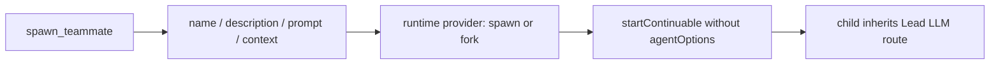
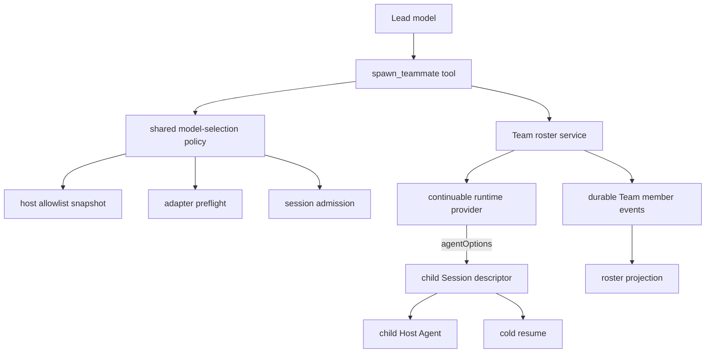
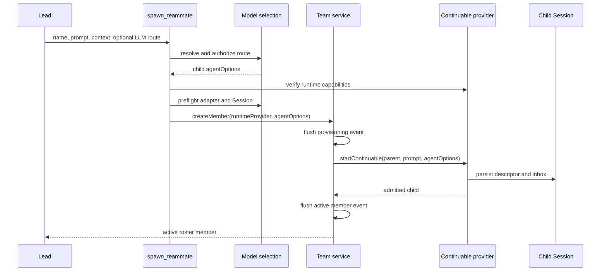
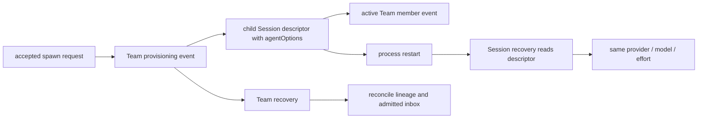

# Agent Note: Agent Team heterogeneous model routing

Status: implemented

English | [中文](2026-09-28-agent-team-heterogeneous-model-routing.zh.md)

## Problem

`spawn_teammate` previously accepted only a teammate name, description, prompt, and context mode. The context mode selected the continuable-subagent runtime provider (`spawn` or `fork`), but the call carried no child `AgentOptions`. `startContinuable` therefore created every teammate with the Lead Agent's LLM provider, model, and compatible reasoning effort.

This collapsed two independent decisions into one overloaded provider concept. Runtime providers decide how a child Session starts and which history it receives; LLM providers decide which adapter and model execute the child. A Team could request fresh or forked context, but it could not assign a specialist model, validate that route before durable roster mutation, or recover the selected route after process restart.

## Decision

The Team tool keeps `context` as the runtime choice and adds optional `provider`, `model`, and `reasoning_effort` fields for the child LLM route. `provider` and `model` form one pair: callers supply both or neither. Omitting the pair preserves compatible inheritance from the Lead. Supplying the pair requires a route returned by `list_subagent_models`; callers do not guess provider or model identifiers.

The Agent Team tool reuses the ordinary subagent model-selection authority through the public `@deepseek-ai/dsh-tool-subagent/model-selection` entry point. That module owns allowlist snapshots, inheritance, reasoning-effort normalization, adapter preflight, and Session-level admission. Team code does not maintain a second model registry or reinterpret adapter capabilities.

The Team service receives two separate values: `provider` remains the continuable runtime provider name, while `agentOptions` carries the resolved LLM provider, model, and optional reasoning effort. It records the runtime provider in the Team member snapshot and passes `agentOptions` to `startContinuable`; the child Session descriptor remains the durable owner of the effective LLM route.

## Architecture

| Layer | Responsibility | Input | Durable output |
|---|---|---|---|
| `spawn_teammate` tool | Exposes model-facing fields and resolves one authorized route before Team mutation | context, provider, model, reasoning effort | None |
| Shared model-selection policy | Applies allowlist, inheritance, normalization, and adapter/session preflight | Lead options and requested route | None |
| Team roster service | Reserves identity, records provisioning, and starts the continuable child | runtime provider and resolved `agentOptions` | Team member events |
| Continuable subagent runtime | Creates fresh or forked history and the child Session | prompt, parent, runtime provider, `agentOptions` | Child Session descriptor and inbox |
| Child Session descriptor | Owns the effective LLM route across unload and restart | admitted `AgentOptions` | provider, model, reasoning effort |

## Request flow

The tool completes every route check before `createMember` appends a provisioning event. Invalid pairs, unlisted routes, unavailable adapters, unsupported reasoning efforts, missing runtime providers, and runtime providers without `agentOptions` capability fail without consuming a Team name or member slot.

## Validation and failure semantics

| Condition | Result | Roster mutation |
|---|---|---|
| Both `provider` and `model` are omitted | Inherit the Lead's compatible route | Allowed after normal preflight |
| Only one of `provider` or `model` is present | Reject with a pair requirement | None |
| Requested pair is absent from the current allowlist | Reject the explicit route | None |
| Adapter, model, or reasoning effort fails preflight | Return the owning validation error | None |
| Runtime provider is missing or lacks child-model capability | Reject before provisioning | None |
| Runtime creation fails after provisioning | Persist the existing failed-member state | Failed member remains visible |

Model selection is opt-in at the deployment layer. When `modelSelectionSettings` is disabled, the Team schema remains fixed-route: the three LLM fields and `list_subagent_models` are absent, and teammates keep the earlier inheritance behavior. The Agent Team profile enables the setting together with the required model-selection service.

## Persistence and recovery

The Team log does not duplicate the child model route. It persists Team identity, context mode, and the runtime provider needed for lineage reconciliation. The child Session descriptor persists `AgentOptions`, so ordinary Session recovery recreates the same adapter and model. Cold Team reconciliation checks the existing direct-parent, continuable, runtime-provider, and initial-message invariants without introducing a second source of model truth.

The roster projection exposes a loaded member's current model for inspection, but that projection is not persistence authority. An unloaded member can omit the display-only model while its Session descriptor still owns the route used at the next cold resume.

## Verification

Focused tests pin explicit heterogeneous routing, allowlist rejection, pair validation, fixed-route schema compatibility, custom runtime-provider names, capability rejection, service forwarding, descriptor persistence, and cold resume on the selected model. Profile tests pin the required model-selection mount, and generated tool/config catalogs pin the model-visible contract.

The implementation passes the affected package tests, TypeScript compilation, lint, generated-catalog freshness, configuration validation, translation pairing, dependency checks, and `git diff --check`. These checks verify both the public route-selection contract and the absence of partial Team state on preflight rejection.

## Alternatives considered

**Reuse `provider` for both meanings.** Rejected because `spawn` and `fork` select runtime/history behavior, while names such as `deepseek` select an LLM adapter. Overloading one field makes capability checks and durable recovery ambiguous.

**Create a Team-only model registry and validator.** Rejected because ordinary subagents already own allowlists, inheritance, adapter preflight, and Session admission. A second policy would drift and could authorize a route that direct subagents reject.

**Accept arbitrary provider and model identifiers from the Lead model.** Rejected because a model can hallucinate identifiers and discover deployment details by trial. `list_subagent_models` and the Host allowlist define the authorized choices.

**Persist the LLM route in Team member events.** Rejected because the child Session descriptor already owns execution options. Duplicating the route creates two recovery authorities that can disagree.

## Consequences

A Lead can assign different allowed models to teammates while retaining fresh/fork context semantics, durable Team identity, and cold-resumable Sessions. The same selection rules now govern ordinary subagents and Team teammates, so deployments have one authorization and compatibility policy.

Explicit heterogeneous routing adds preflight work before teammate creation and requires the runtime provider to support child `agentOptions`. This cost prevents invalid durable members and makes unsupported deployments fail before provisioning. Fixed-route deployments keep the previous schema and behavior.

This decision extends the [durable Agent Teams decision](../feature/2026-08-05-agent-teams.md); that note remains the owner of roster, mailbox, task, checkout, and lifecycle semantics.
