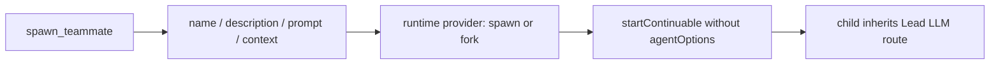
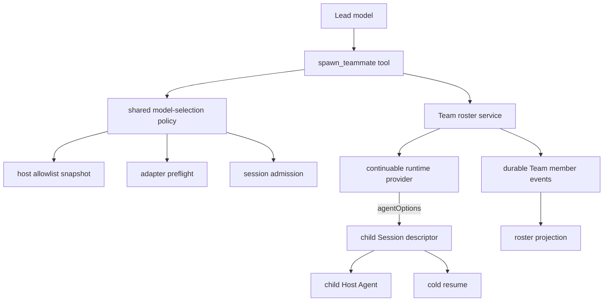
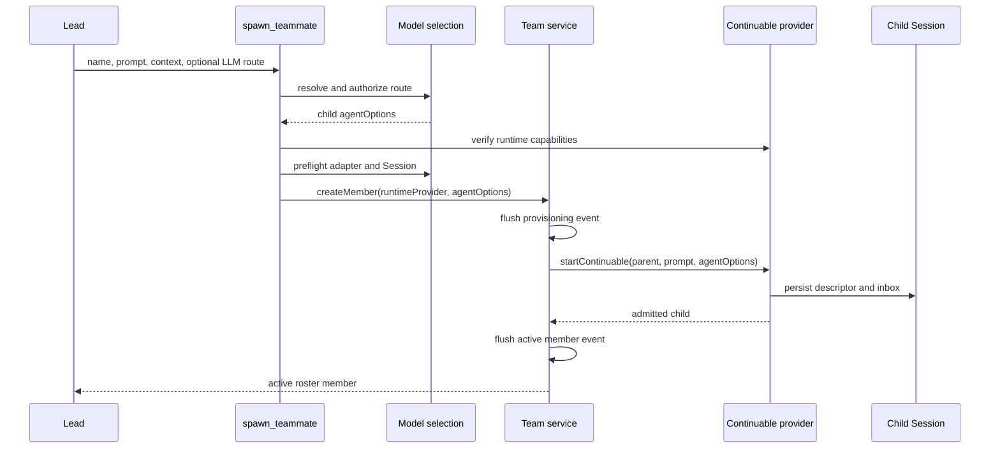
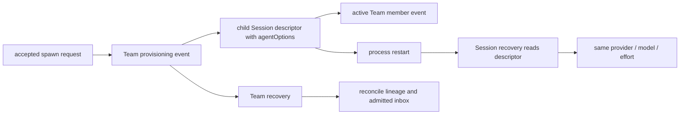

# Agent Note: Agent Team 异构模型路由

Status: implemented

[English](2026-09-28-agent-team-heterogeneous-model-routing.md) | 中文

## Problem

`spawn_teammate` 过去只接收队友名称、描述、提示词和上下文模式。上下文模式选择 continuable-subagent 运行时 provider（`spawn` 或 `fork`），但调用不会携带子 Agent 的 `AgentOptions`。因此，`startContinuable` 创建的每个队友都会继承 Lead Agent 的 LLM provider、模型和兼容的推理强度。

这把两个相互独立的决策压进了一个含义过载的 provider 概念。运行时 provider 决定子 Session 如何启动以及获得哪些历史；LLM provider 决定由哪个适配器和模型执行子 Session。Team 可以请求 fresh 或 fork 上下文，但不能分配专家模型、不能在持久化 roster 变更前验证路由，也不能在进程重启后恢复所选路由。

## Decision

Team 工具保留 `context` 作为运行时选择，并新增可选的 `provider`、`model` 和 `reasoning_effort` 字段来表示子 LLM 路由。`provider` 与 `model` 构成一组：调用方同时提供两者或都不提供。省略这一组会保留从 Lead 继承兼容路由的行为。提供这一组时，路由必须来自 `list_subagent_models`；调用方不能猜测 provider 或模型标识。

Agent Team 工具通过公开入口 `@deepseek-ai/dsh-tool-subagent/model-selection` 复用普通 subagent 的模型选择权威实现。该模块负责 allowlist 快照、继承、推理强度规范化、适配器预检和 Session 级准入。Team 代码不维护第二套模型注册表，也不重新解释适配器能力。

Team 服务接收两个独立值：`provider` 仍是 continuable 运行时 provider 名称，而 `agentOptions` 携带已解析的 LLM provider、模型和可选推理强度。服务把运行时 provider 记录在 Team member 快照中，并把 `agentOptions` 传给 `startContinuable`；子 Session descriptor 仍是有效 LLM 路由的持久化权威来源。

## Architecture

| 层 | 职责 | 输入 | 持久化输出 |
|---|---|---|---|
| `spawn_teammate` 工具 | 暴露模型可见字段，并在 Team 变更前解析一条已授权路由 | context、provider、model、推理强度 | 无 |
| 共享模型选择策略 | 执行 allowlist、继承、规范化以及适配器和 Session 预检 | Lead options 和请求路由 | 无 |
| Team roster 服务 | 预留身份、记录 provisioning 并启动 continuable 子项 | 运行时 provider 和已解析的 `agentOptions` | Team member 事件 |
| Continuable subagent 运行时 | 创建 fresh 或 fork 历史和子 Session | prompt、parent、运行时 provider、`agentOptions` | 子 Session descriptor 和 inbox |
| 子 Session descriptor | 在卸载和重启期间持有有效 LLM 路由 | 已准入的 `AgentOptions` | provider、model、推理强度 |

## Request flow

工具会在 `createMember` 追加 provisioning 事件前完成全部路由检查。字段配对错误、未列出的路由、不可用的适配器、不支持的推理强度、缺失的运行时 provider，以及不支持 `agentOptions` 的运行时 provider 都会失败，并且不会消耗 Team 名称或成员槽位。

## Validation and failure semantics

| 条件 | 结果 | Roster 变更 |
|---|---|---|
| 同时省略 `provider` 和 `model` | 继承 Lead 的兼容路由 | 通过正常预检后允许 |
| 只提供 `provider` 或 `model` 中的一个 | 以配对要求拒绝 | 无 |
| 请求组合不在当前 allowlist 中 | 拒绝显式路由 | 无 |
| 适配器、模型或推理强度预检失败 | 返回所属校验逻辑的错误 | 无 |
| 运行时 provider 缺失或不支持子模型能力 | 在 provisioning 前拒绝 | 无 |
| Provisioning 后运行时创建失败 | 持久化现有 failed-member 状态 | 失败成员保持可见 |

模型选择在部署层显式启用。`modelSelectionSettings` 关闭时，Team schema 保持固定路由：三个 LLM 字段与 `list_subagent_models` 都不存在，队友维持原有继承行为。Agent Team profile 会同时启用该设置和所需的模型选择服务。

## Persistence and recovery

Team 日志不会重复存储子模型路由。它持久化 Team 身份、上下文模式以及血缘对账所需的运行时 provider。子 Session descriptor 持久化 `AgentOptions`，因此普通 Session 恢复会重新创建同一个适配器和模型。Team 冷恢复对账会检查既有的直接父级、continuable、运行时 provider 和初始消息不变量，而不会引入第二个模型事实来源。

Roster projection 会显示已加载成员的当前模型以便检查，但该 projection 不是持久化权威来源。未加载成员可能省略仅用于显示的模型，但其 Session descriptor 仍持有下一次冷恢复所使用的路由。

## Verification

聚焦测试固定了显式异构路由、allowlist 拒绝、字段配对校验、固定路由 schema 兼容性、自定义运行时 provider 名称、能力拒绝、服务转发、descriptor 持久化以及在所选模型上的冷恢复。Profile 测试固定所需的模型选择挂载，生成的工具和配置目录固定模型可见契约。

实现通过了受影响的包测试、TypeScript 编译、lint、生成目录新鲜度、配置校验、翻译配对、依赖检查和 `git diff --check`。这些检查同时验证公开路由选择契约，以及预检拒绝时不会产生部分 Team 状态。

## Alternatives considered

**让 `provider` 同时表示两个含义。** 拒绝，因为 `spawn` 和 `fork` 选择运行时和历史行为，而 `deepseek` 等名称选择 LLM 适配器。一个字段承载两种含义会让能力检查和持久化恢复产生歧义。

**创建 Team 专用模型注册表和校验器。** 拒绝，因为普通 subagent 已经负责 allowlist、继承、适配器预检和 Session 准入。第二套策略会发生漂移，并可能授权被直接 subagent 拒绝的路由。

**接受 Lead 模型提供的任意 provider 和 model 标识。** 拒绝，因为模型可能臆造标识，并通过试错探测部署细节。`list_subagent_models` 与 Host allowlist 定义获准选择。

**把 LLM 路由持久化到 Team member 事件。** 拒绝，因为子 Session descriptor 已经负责执行 options。重复存储路由会产生两个可能不一致的恢复权威来源。

## Consequences

Lead 可以给不同队友分配不同的获准模型，同时保留 fresh/fork 上下文语义、持久化 Team 身份和可冷恢复的 Session。普通 subagent 与 Team teammate 现在遵循同一套选择规则，因此部署只有一套授权和兼容性策略。

显式异构路由会在创建队友前增加预检工作，并要求运行时 provider 支持子 `agentOptions`。这项成本可以防止生成无效的持久化成员，并使不支持的部署在 provisioning 前失败。固定路由部署保持之前的 schema 和行为。

本决策扩展[持久化 Agent Teams 决策](../feature/2026-08-05-agent-teams.zh.md)；后者仍负责 roster、mailbox、task、checkout 和生命周期语义。
