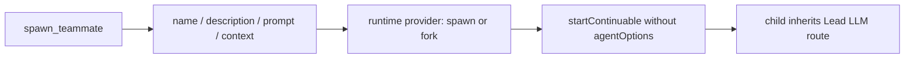
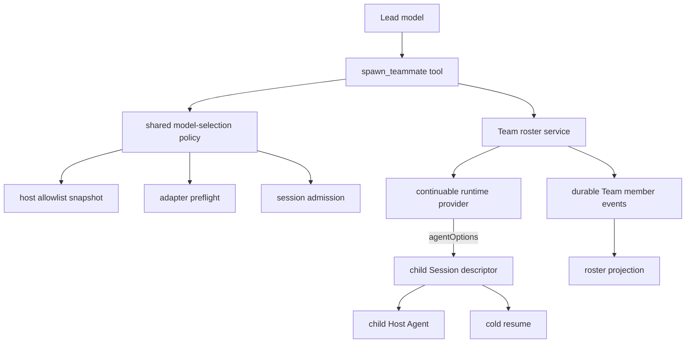
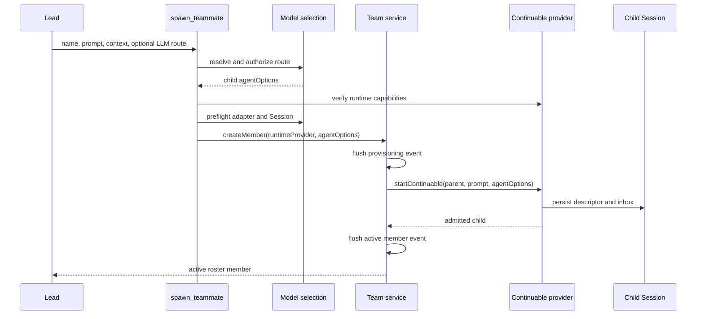
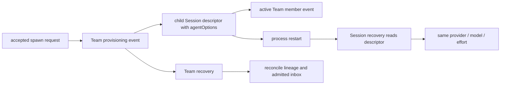

# Agent Note: Agent Team 异构模型路由

Status: implemented

[English](2026-09-28-agent-team-heterogeneous-model-routing.md) | 中文

## Problem

我们把 `spawn_teammate` 的调用链从头到尾梳理了一遍，发现它过去只接收队友名称、描述、提示词和上下文模式。上下文模式会选择 continuable-subagent 运行时 provider（`spawn` 或 `fork`），但调用不会携带子 Agent 的 `AgentOptions`。实际结果就是：`startContinuable` 创建的每个队友都会继承 Lead Agent 的 LLM provider、模型和兼容的推理强度。

真正别扭的地方，是两个完全不同的决策被塞进了同一个 provider 概念里。运行时 provider 决定子 Session 怎么启动、拿到哪段历史；LLM provider 决定由哪个适配器和模型执行这个子 Session。Team 虽然可以选择 fresh 或 fork 上下文，却不能为任务分配更合适的专家模型，也不能在持久化 roster 变更前验证路由，更谈不上在进程重启后恢复原来的选择。

## Decision

我们保留 `context` 作为运行时选择，同时新增可选的 `provider`、`model` 和 `reasoning_effort`，专门描述子 LLM 路由。`provider` 与 `model` 是一组：要么同时提供，要么都不提供。都不提供时，行为和以前一样，从 Lead 继承兼容路由；明确选择时，路由必须来自 `list_subagent_models`，不需要模型或接入方靠猜来填写 provider 和模型标识。

我们没有给 Team 另起一套模型选择逻辑，而是通过公开入口 `@deepseek-ai/dsh-tool-subagent/model-selection` 复用普通 subagent 的权威实现。Allowlist 快照、继承、推理强度规范化、适配器预检和 Session 级准入，仍然由同一个模块负责。这样做的好处很直接：Team 代码不用维护第二套模型注册表，也不会用另一种方式重新解释适配器能力。

等请求进入 Team 服务时，这两个选择已经被明确拆开：`provider` 仍表示 continuable 运行时 provider，`agentOptions` 则携带解析后的 LLM provider、模型和可选推理强度。服务把运行时 provider 记录进 Team member 快照，再把 `agentOptions` 传给 `startContinuable`；真正决定子 Agent 使用哪条 LLM 路由的持久化权威，仍然是子 Session descriptor。

## Architecture

我们刻意让这层拆分在架构上保持可见，因为每一层回答的问题不同：模型能请求什么、部署允许什么、子 Session 怎么启动，以及选中的路由最终存在哪里。

| 层 | 职责 | 输入 | 持久化输出 |
|---|---|---|---|
| `spawn_teammate` 工具 | 暴露模型可见字段，并在 Team 变更前解析一条已授权路由 | context、provider、model、推理强度 | 无 |
| 共享模型选择策略 | 执行 allowlist、继承、规范化以及适配器和 Session 预检 | Lead options 和请求路由 | 无 |
| Team roster 服务 | 预留身份、记录 provisioning 并启动 continuable 子项 | 运行时 provider 和已解析的 `agentOptions` | Team member 事件 |
| Continuable subagent 运行时 | 创建 fresh 或 fork 历史和子 Session | prompt、parent、运行时 provider、`agentOptions` | 子 Session descriptor 和 inbox |
| 子 Session descriptor | 在卸载和重启期间持有有效 LLM 路由 | 已准入的 `AgentOptions` | provider、model、推理强度 |

## Request flow

我们把安全边界放在持久化 Team 状态发生变化之前。工具会先完成全部路由检查，确认无误后，`createMember` 才会追加 provisioning 事件。字段配对错误、未列出的路由、不可用的适配器、不支持的推理强度、缺失的运行时 provider，以及不支持 `agentOptions` 的运行时 provider 都会直接失败，不会白白占掉 Team 名称或成员槽位。

## Validation and failure semantics

| 条件 | 结果 | Roster 变更 |
|---|---|---|
| 同时省略 `provider` 和 `model` | 继承 Lead 的兼容路由 | 通过正常预检后允许 |
| 只提供 `provider` 或 `model` 中的一个 | 以配对要求拒绝 | 无 |
| 请求组合不在当前 allowlist 中 | 拒绝显式路由 | 无 |
| 适配器、模型或推理强度预检失败 | 返回所属校验逻辑的错误 | 无 |
| 运行时 provider 缺失或不支持子模型能力 | 在 provisioning 前拒绝 | 无 |
| Provisioning 后运行时创建失败 | 持久化现有 failed-member 状态 | 失败成员保持可见 |

我们也把模型选择保留为部署层的显式能力。`modelSelectionSettings` 关闭时，Team schema 仍然是固定路由：三个 LLM 字段与 `list_subagent_models` 都不会出现，队友继续沿用原来的继承行为。Agent Team profile 会把该设置和所需的模型选择服务一起启用，避免部署只开了一半能力。

## Persistence and recovery

我们没有把子模型路由再复制一份到 Team 日志里。Team 日志只持久化 Team 身份、上下文模式，以及血缘对账所需的运行时 provider；子 Session descriptor 负责持久化 `AgentOptions`，因此普通 Session 恢复就能重新创建同一个适配器和模型。Team 冷恢复只需检查既有的直接父级、continuable、运行时 provider 和初始消息不变量，不会凭空多出第二个模型事实来源。

平时排查问题时，roster projection 会显示已加载成员当前使用的模型。我们有意让这个字段只负责展示，不让它承担持久化职责。未加载成员可能暂时不显示模型，但它的 Session descriptor 仍然保存着下一次冷恢复要使用的路由。

## Verification

我们重点测试了这套设计最容易悄悄出错的地方：显式异构路由、allowlist 拒绝、字段配对校验、固定路由 schema 兼容性、自定义运行时 provider 名称、能力拒绝、服务转发、descriptor 持久化，以及在所选模型上的冷恢复。Profile 测试固定所需的模型选择挂载，生成的工具和配置目录则固定模型可见契约。

在当前分支上，实现通过了受影响的包测试、TypeScript 编译、lint、生成目录新鲜度、配置校验、翻译配对、依赖检查和 `git diff --check`。这些检查既覆盖公开的路由选择契约，也覆盖一个不太显眼但很重要的保证：预检被拒绝时，不会留下半截 Team 状态。

## Alternatives considered

**让 `provider` 同时表示两个含义。** 我们没有这样做，因为 `spawn` 和 `fork` 选择运行时与历史行为，而 `deepseek` 这类名称选择 LLM 适配器。让一个字段同时承担两种含义，会让能力检查和持久化恢复都变得含糊。

**创建 Team 专用模型注册表和校验器。** 我们也没有这样做，因为普通 subagent 已经负责 allowlist、继承、适配器预检和 Session 准入。第二套策略迟早会发生漂移，甚至可能放行被直接 subagent 拒绝的路由。

**接受 Lead 模型提供的任意 provider 和 model 标识。** 我们拒绝这条捷径，因为模型可能臆造标识，也可能通过反复试错探测部署细节。`list_subagent_models` 与 Host allowlist 会直接给出清晰、获准的选择范围。

**把 LLM 路由持久化到 Team member 事件。** 我们没有重复存储，因为子 Session descriptor 已经负责执行 options。再存一份看似更保险，实际上会制造两个可能在重启后互相打架的恢复权威来源。

## Consequences

这次修复让 Lead 可以给不同队友分配不同的获准模型，同时不牺牲 fresh/fork 上下文语义、持久化 Team 身份和可冷恢复的 Session。更重要的是，普通 subagent 与 Team teammate 现在遵循同一套选择规则，一套部署只需要理解一套授权和兼容性策略。

当然，这不是零成本的：显式异构路由会在创建队友前多做一些预检，运行时 provider 也必须支持子 `agentOptions`。我们愿意付出这点成本，因为它能防止无效成员进入持久化状态，并让不支持的部署在 provisioning 前就说清楚。固定路由部署仍然保持原来的 schema 和行为。

这是一项针对性的扩展，基础仍然来自[持久化 Agent Teams 决策](../feature/2026-08-05-agent-teams.zh.md)。Roster、mailbox、task、checkout 和生命周期语义，继续由那份文档负责。
